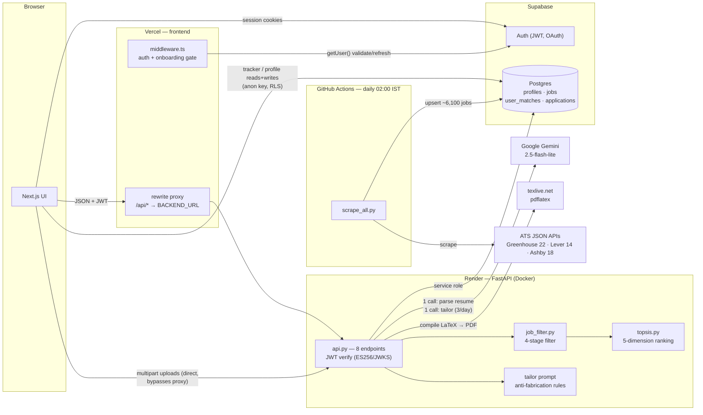
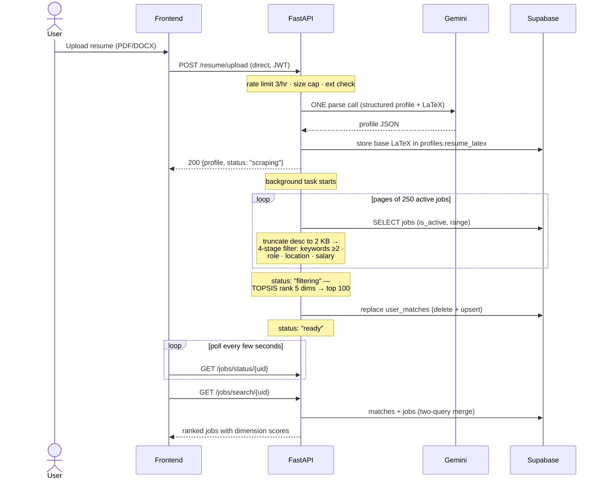
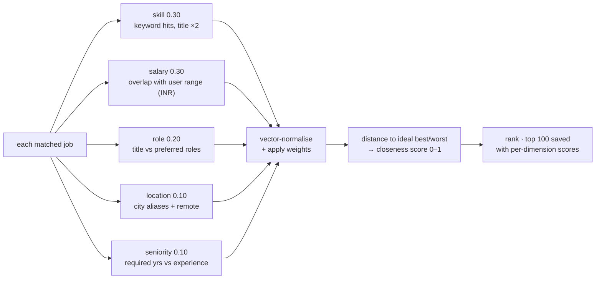
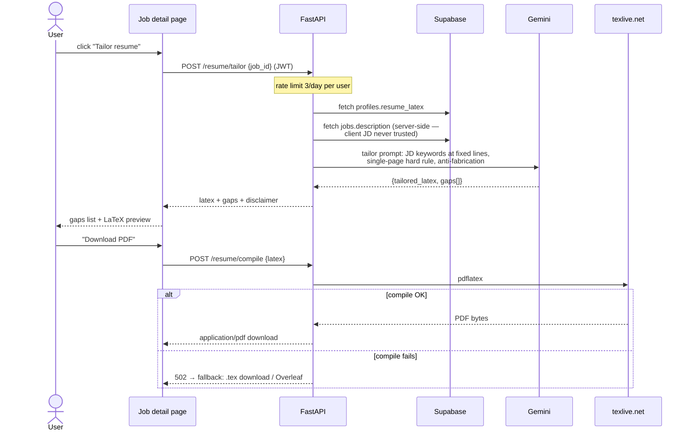
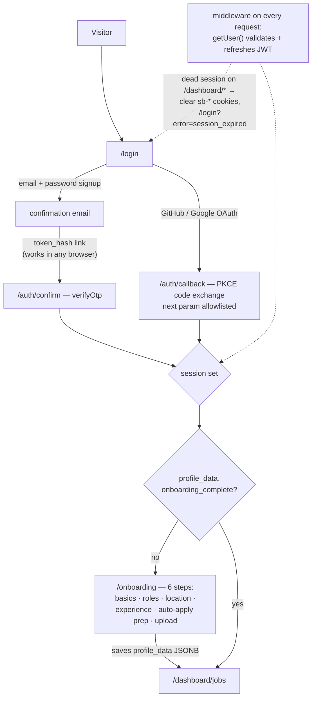
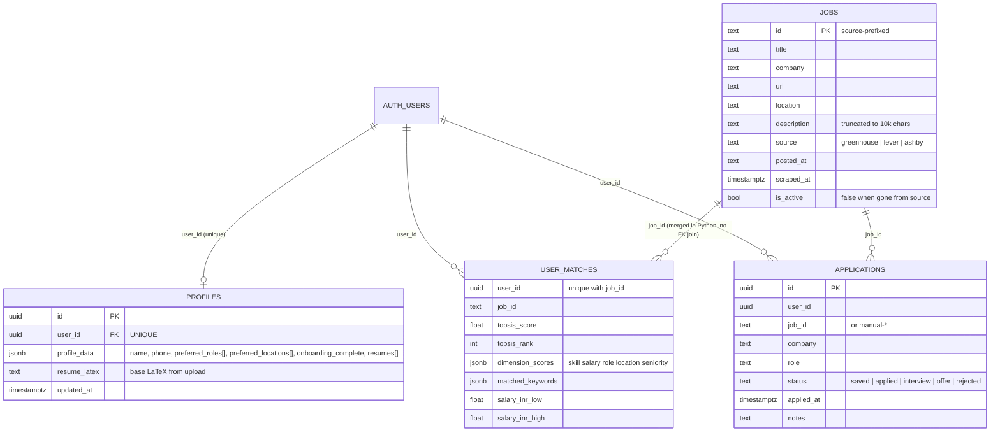
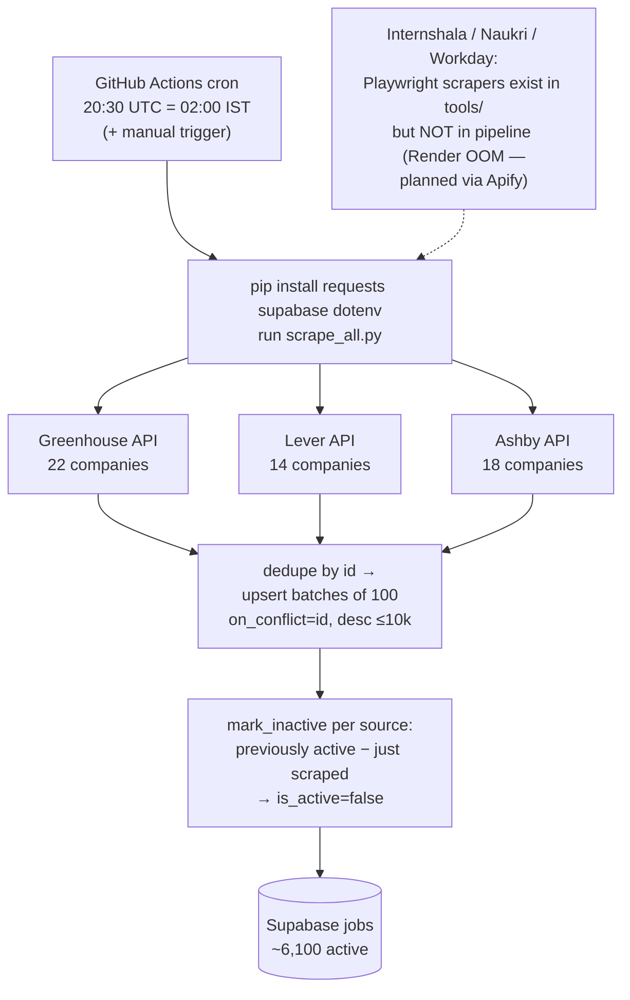
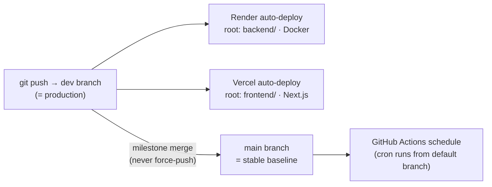

# Career Ops

**AI job-discovery agent — drop your resume, get ranked job matches from 50+ company career portals, and tailor your resume to any of them.**

[](https://github.com/Anshm1234/Career_ops/actions/workflows/daily-scrape.yml)

🌐 **Live:** [career-ops-frontend.vercel.app](https://career-ops-frontend.vercel.app) · Backend: [Render](https://career-ops-vo9j.onrender.com/health)

---

## Overview

Career Ops scrapes ~6,100 jobs daily from 54 companies (Greenhouse, Lever, Ashby), parses your resume with **exactly one** Gemini call, filters and ranks every job with a **deterministic TOPSIS algorithm** (explainable scores, not a black-box LLM), and generates a job-specific tailored resume as compiled LaTeX → PDF.

| ✅ Works today | 🔜 Coming soon |
|---|---|
| Multi-source job aggregation (daily cron) | Auto-apply (fields being collected now) |
| One-call AI resume parsing (PDF/DOCX) | Internshala + more portals via Apify |
| 4-stage filtering + TOPSIS ranking (5 dimensions) | Premium tier |
| Resume tailoring → LaTeX → PDF (3/day) | Full pytest suite |
| Application tracker (saved → applied → interview → offer) | |
| Auth (email + OAuth), 6-step onboarding, rate limiting | |

## Tech stack

| Layer | Technology | Hosted on |
|---|---|---|
| Frontend | Next.js 16 · Tailwind · shadcn/ui · Three.js | Vercel |
| Backend | FastAPI (Python 3.11) · Docker | Render |
| Database + Auth | Supabase (PostgreSQL, JWT/OAuth) | Supabase cloud |
| LLM | Google `gemini-2.5-flash-lite` | Google AI |
| PDF compile | pdflatex via texlive.net | external |
| Scraper cron | GitHub Actions (daily 02:00 IST) | GitHub |

---

## System architecture



JSON requests go through a Vercel rewrite proxy (hides the backend origin); **file uploads bypass it** and hit Render directly because Vercel's edge mangles multipart bodies. The backend is the only writer to `jobs`/`user_matches` (service role); the browser talks to `profiles`/`applications` directly under Supabase RLS.

## Resume upload → match pipeline



The whole pipeline is **memory-safe by construction**: jobs stream through in 250-row pages, descriptions are truncated before filtering and dropped after — Render's 512 MB instance never holds the full corpus.

## How ranking works (TOPSIS)



Every match shows its five dimension scores in the UI ("Why this is a match") — ranking is fully explainable and reproducible, with **zero LLM calls per job**. Weights are user-tunable and re-ranking is instant.

## Resume tailoring



The prompt enforces **anti-fabrication** (nothing not in the base resume; missing requirements go to a "gaps" list instead), exact JD keyword placement at ATS-scannable positions, and a hard single-page rule.

## Auth + onboarding



Backend JWT verification pins **ES256 via JWKS** (24 h key cache) with an HS256 fallback for legacy projects — the algorithm is never chosen by the token header.

## Data model



User preferences live in a single `profile_data` **JSONB blob** (schema-flexible, one row per user) rather than columns. `user_matches → jobs` is merged with two queries in Python because PostgREST's embedded join needs an FK in its schema cache. Browser-accessed tables (`profiles`, `applications`) rely on Supabase **RLS policies**; `jobs`/`user_matches` are backend-only via service role.

## Daily data refresh



## Deployment



---

## Repository structure

```
career-ops/
├── .github/workflows/daily-scrape.yml   # daily scrape cron
├── backend/                             # FastAPI (Render root dir)
│   ├── api.py            # all endpoints, auth, pipeline, tailor prompt, DB helpers
│   ├── config.py         # env loader (_require pattern), paths
│   ├── run.py            # entrypoint — reads PORT from env for Render
│   ├── scrape_all.py     # daily scraper: all ATS sources → Supabase upsert
│   ├── test_scrapers.py  # smoke test for the three ATS scrapers
│   ├── Dockerfile        # python:3.11-slim + Playwright chromium
│   ├── data/companies.py # verified ATS slugs (production list)
│   └── tools/
│       ├── resume_parser.py  # PDF/DOCX text extract → ONE Gemini call → profile + LaTeX
│       ├── job_filter.py     # 4-stage filter: keywords / role / location / salary
│       ├── topsis.py         # 5-dimension TOPSIS ranking (pure Python)
│       ├── salary.py         # any currency/period → INR-per-annum normaliser
│       ├── greenhouse.py · lever.py · ashby.py   # HTTP JSON scrapers (in pipeline)
│       └── internshala.py · naukri.py · workday.py  # Playwright scrapers (NOT in pipeline)
└── frontend/                            # Next.js 16 (Vercel root dir)
    ├── middleware.ts                    # auth gate + onboarding redirect (all routes)
    ├── next.config.mjs                  # /api/* rewrite proxy + security headers
    ├── app/
    │   ├── page.tsx                     # landing page
    │   ├── login/ · onboarding/         # auth screen · 6-step wizard
    │   ├── auth/callback/ · auth/confirm/  # OAuth PKCE · email token-hash verify
    │   └── dashboard/
    │       ├── jobs/ · jobs/[jobId]/    # ranked matches · detail + tailor + save
    │       ├── tracker/                 # application tracker (Supabase-persisted)
    │       └── profile/                 # prefs + TOPSIS weights → re-rank
    ├── components/
    │   ├── auth/auth-screen.tsx         # sign in/up + OAuth + error banners
    │   ├── dashboard/                   # sidebar, job cards, upload dialog, top-nav
    │   └── landing/                     # hero, features, pricing, globe, mockups
    ├── lib/
    │   ├── api.ts                       # JWT-attached fetch; 401 → forced re-login
    │   ├── supabase.ts                  # browser client
    │   └── onboarding-options.ts        # predefined roles + locations
    └── utils/supabase/                  # server client + middleware session logic
```

## Backend endpoints

| Endpoint | Auth | Purpose |
|---|---|---|
| `GET /health` | — | liveness check |
| `POST /resume/upload` | JWT | parse resume (1 Gemini call), kick off match pipeline · **3/hr** |
| `GET /jobs/status/{uid}` | JWT | pipeline status: `scraping → filtering → ready` |
| `GET /jobs/search/{uid}` | JWT | ranked matches (two-query merge) |
| `GET /profile/{uid}` | JWT | parsed profile |
| `POST /profile/{uid}/update` | JWT | update prefs/weights → re-filter + re-rank (no LLM) |
| `POST /resume/tailor` | JWT | job-specific LaTeX resume (1 Gemini call) · **3/day** |
| `POST /resume/compile` | JWT | LaTeX → PDF via texlive.net (`.tex` fallback) |

---

## Engineering decisions

- **TOPSIS instead of per-job LLM scoring.** An early agentic-orchestrator design scored jobs with LLM calls — at ~6,100 jobs/user that meant unusable latency and instant free-tier quota death. TOPSIS ranks everything in milliseconds, is deterministic, and each score decomposes into 5 explainable dimensions. Exactly **one** Gemini call per upload is a hard rule.
- **Streaming filter vs Render's 512 MB.** Loading the full jobs corpus OOM-killed the free instance. Fix: paginate 250 rows at a time, truncate descriptions to 2 KB before filtering, drop them after — peak memory stays flat regardless of corpus size. Same reason live Playwright scraping (Internshala) is disabled in production.
- **Proxy for JSON, direct for uploads.** Vercel's edge rewrites mangle multipart bodies, so JSON goes through the `/api/*` proxy (hides backend origin) while uploads hit Render directly with CORS.
- **Token-hash email confirmation.** PKCE `?code=` exchange breaks when the confirmation link opens in a different browser than the signup (no code-verifier cookie). A `verifyOtp(token_hash)` route is self-contained — new users land signed-in on onboarding from any mail client.
- **A test pass caught 4 real matching bugs**: "3–5 years" seniority requiring the upper bound; `₹18L–₹25L` collapsing to `(18L, 18L)`; `$120k–$150k` losing its high end; and `₹5,000` (a joining voucher) being read as a ₹50 Cr salary. All fixed with regression checks — parsing money out of free text is genuinely hostile territory.

## Local development

```bash
git clone https://github.com/Anshm1234/Career_ops.git && cd Career_ops
```

**Backend** (terminal 1):

```bash
cd backend
python -m venv venv && venv\Scripts\activate     # Windows
pip install -r requirements.txt
copy .env.example .env                            # then fill in values
uvicorn api:app --reload                          # → http://localhost:8000
```

**Frontend** (terminal 2):

```bash
cd frontend
npm install
# create .env.local with the vars below
npm run dev                                       # → http://localhost:3000
```

**Scraper / smoke test:**

```bash
cd backend
python scrape_all.py        # full scrape → Supabase
python test_scrapers.py     # one company per ATS source
```

## Environment variables

| Variable | Service | Purpose |
|---|---|---|
| `GEMINI_API_KEY` | backend | Google AI Studio key |
| `GEMINI_MODEL` | backend | `gemini-2.5-flash-lite` |
| `SUPABASE_URL` | backend + scraper CI | project URL |
| `SUPABASE_SERVICE_KEY` | backend + scraper CI | service role key (server-only!) |
| `SUPABASE_JWT_SECRET` | backend | HS256 fallback verification |
| `NEXT_PUBLIC_SUPABASE_URL` | frontend | project URL (public) |
| `NEXT_PUBLIC_SUPABASE_ANON_KEY` | frontend | anon key (public, RLS-guarded) |
| `BACKEND_URL` | frontend (build) | rewrite proxy target |
| `NEXT_PUBLIC_BACKEND_URL` | frontend (build) | direct upload target |

> `NEXT_PUBLIC_*` and `BACKEND_URL` bake in at **build time** — redeploy with cleared cache after changing.

## Testing

Honest status: **no full pytest suite yet.** What exists:

- `backend/test_scrapers.py` — live smoke test (one company per ATS source)
- The salary/seniority fixes above ship with an 8-case verification script (see commit `394a4c6`); converting it into a proper pytest suite is the top roadmap item
- CI: the daily-scrape workflow doubles as an integration check of scrapers + DB writes

## Roadmap

- [ ] pytest suite for `salary.py`, `topsis.py`, `job_filter.py`
- [ ] Auto-apply engine (onboarding already collects the required fields)
- [ ] Internshala + Naukri via Apify (replaces the OOM-blocked Playwright path)
- [ ] Supabase auth hardening: CAPTCHA, sign-in rate limits
- [ ] Custom domain

## Author

**Ansh Madaan** — final-year CS, Thapar Institute
GitHub: [@Anshm1234](https://github.com/Anshm1234)

---

*Built with FastAPI, Next.js, Supabase, and one very carefully rationed Gemini call.*
