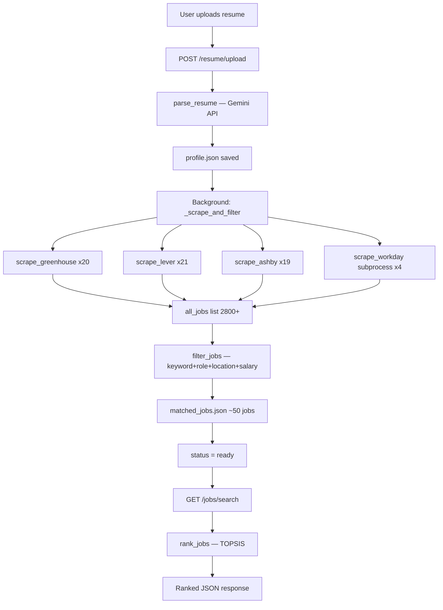
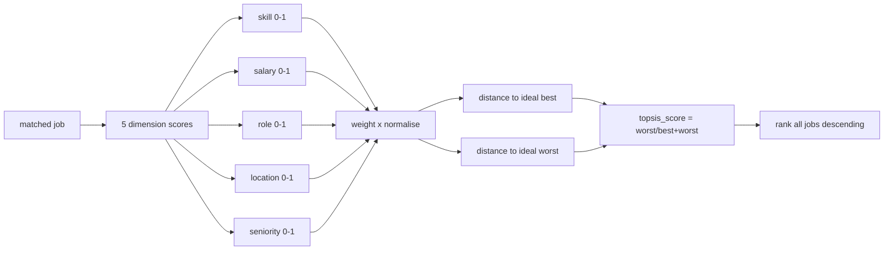
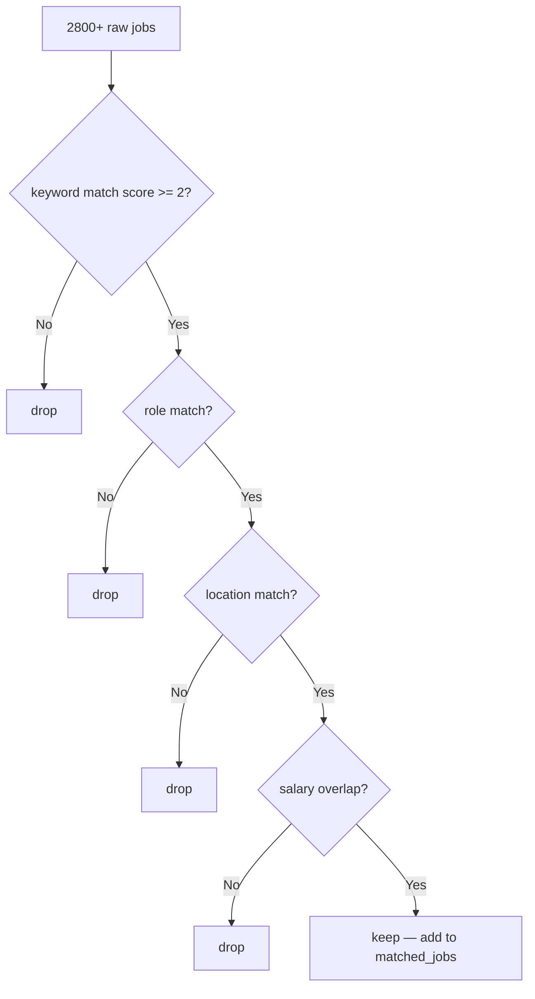

# Career Ops — Project Context & Knowledge Base

> **Single source of truth for the Career Ops project.**
> Written for future engineers, AI agents, architects, and LLMs continuing this work.

---

## 1. Executive Summary

**Career Ops** is an AI-powered job discovery and application agent built as a FastAPI backend service. It automates the entire job search pipeline — from scraping 40+ company job portals, parsing a user's resume, filtering and ranking thousands of listings, to (in progress) tailoring resumes and auto-applying on behalf of the user.

| Attribute | Detail |
|---|---|
| **Core Mission** | Eliminate manual job searching by automating discovery, filtering, ranking, and application |
| **Problem Solved** | Job seekers spend hours manually checking company portals, copy-pasting resumes, and tracking applications |
| **Target Users** | Final-year CS/engineering students, early-career developers, anyone actively job hunting |
| **Current State** | Scraping + filtering + TOPSIS ranking complete. Resume tailoring and auto-apply in development |
| **Tech Stack** | Python, FastAPI, Gemini API, Playwright, Greenhouse/Lever/Ashby APIs |
| **Entry Point** | `uvicorn api:app --reload` |

---

## 2. Project Evolution Timeline

### Stage 1 — Original Concept (Inspiration)
- **Goal:** Replicate Santiago's open-source Career Ops agent — scrape jobs, score them, apply automatically
- **Original flow:** Agent uses Gemini tool-calling to orchestrate scrapers, dump all jobs, send everything to Gemini for scoring
- **Problem discovered:** 45+ companies × 50 jobs = 800–2000 job descriptions in one Gemini prompt → context window overflow, API quota exhaustion
- **Decision:** Abandon the single-LLM-does-everything approach

### Stage 2 — Architecture Pivot (Pre-filter before LLM)
- **Goal:** Fix the context window problem
- **Decision:** Parse resume first → extract keywords → use keywords to filter jobs locally → only send matched jobs to Gemini
- **New flow:** Resume → `profile.json` → keyword filter → Gemini scoring per job
- **Problem discovered:** Per-job Gemini calls still expensive (800 jobs × 1 API call = 800 calls)
- **Decision:** Replace per-job Gemini scoring with pure-Python TOPSIS

### Stage 3 — TOPSIS Ranking (No LLM for scoring)
- **Goal:** Score and rank jobs without any LLM calls after the initial resume parse
- **Decision:** Implement TOPSIS multi-criteria decision algorithm in pure Python
- **Dimensions:** skill match, salary fit, location, role alignment, seniority
- **Result:** Resume parse = 1 Gemini call total. Everything else is local Python

### Stage 4 — FastAPI Web Product (Multi-user)
- **Goal:** Make it a real product where any user can upload their resume
- **Decision:** Build FastAPI backend, per-user `uuid4` sessions, background scraping
- **Key decisions:**
  - Per-user `data/users/{id}/` directories (not shared state)
  - Background tasks for scraping (immediate API response)
  - Status polling pattern (`scraping → filtering → ready → failed`)

### Stage 5 — Windows Compatibility (Playwright Event Loop)
- **Problem:** `sync_playwright` crashes inside FastAPI's async event loop on Windows (`ProactorEventLoop`)
- **Attempts:** ThreadPoolExecutor (failed — threads inherit parent loop), multiprocessing (failed — can't pickle local functions on Windows spawn mode)
- **Solution:** `subprocess.run([sys.executable, "-c", script])` — spawn a fresh Python process per Workday company, no shared state, no pickle

### Stage 6 — Salary Normalisation (INR conversion)
- **Goal:** User inputs salary in INR, jobs may list in USD/GBP/LPA/hourly
- **Solution:** `tools/salary.py` — two-pass extraction: Pass 0 = hardcoded patterns (LPA, $, £, ₹), Pass 1 = standalone patterns, Pass 2 = general regex
- **Key insight:** Job descriptions are raw HTML — must run `html.unescape()` + strip tags before salary regex

### Stage 7 — Keyword Quality (Single-letter bug)
- **Problem:** Profile contained `"R"` (the language) → matched every job description containing the letter "r"
- **Fix 1:** Word-boundary regex `\b` for terms ≤ 2 chars
- **Fix 2:** Drop single-character terms entirely from match list
- **Fix 3:** Prompt Gemini to write `"R programming"` not `"R"`

### Stage 8 — Next (In Development)
- **Resume tailoring:** Gemini rewrites resume bullets to match specific job description keywords
- **ATS-optimised PDF generation:** Generate tailored PDF per job
- **Auto-apply:** Playwright fills and submits application forms automatically

---

## 3. Current System Architecture

```
User (browser/curl)
      │
      ▼
POST /resume/upload  ──►  parse_resume()  ──►  Gemini API (1 call)
      │                        │
      │                   profile.json
      │                        │
      ▼                        ▼
FastAPI BackgroundTask  ──►  _scrape_and_filter()
      │                        │
      │          ┌─────────────┼─────────────┐──────────────┐
      │          ▼             ▼             ▼              ▼
      │    Greenhouse      Lever API     Ashby GraphQL   Workday
      │    JSON API        (REST)        (GraphQL)       (subprocess
      │                                                  + Playwright)
      │          └─────────────┴─────────────┘──────────────┘
      │                        │
      │                   all_jobs[]
      │                        │
      │                   filter_jobs()  ←─ keyword + role + location + salary
      │                        │
      │                matched_jobs.json
      │                        │
      ▼                        ▼
GET /jobs/status  ◄──  status.json  (scraping/filtering/ready/failed)

GET /jobs/search  ──►  rank_jobs() (TOPSIS)  ──►  ranked JSON response
```

---

## 4. File Structure

```
career-ops/
├── api.py                  ← FastAPI entry point, all endpoints
├── main.py                 ← CLI entry point (legacy, still works)
├── config.py               ← env vars, paths, profile_path() helper
├── requirements.txt
├── agents/
│   ├── orchestrator.py     ← Original Gemini agent (legacy, used by main.py)
│   └── tool_definitions.py ← Gemini function schemas (legacy)
├── tools/
│   ├── greenhouse.py       ← Scraper: public JSON API
│   ├── lever.py            ← Scraper: public JSON API
│   ├── ashby.py            ← Scraper: GraphQL API
│   ├── workday.py          ← Scraper: Playwright browser automation
│   ├── resume_parser.py    ← PDF/DOCX → Gemini → profile.json
│   ├── job_filter.py       ← keyword + role + location + salary filtering
│   ├── salary.py           ← salary extraction + INR normalisation
│   └── topsis.py           ← TOPSIS ranking algorithm (pure Python)
├── data/
│   ├── companies.py        ← master list of companies by ATS
│   ├── profile.json        ← default profile template
│   └── users/
│       └── {user_id}/
│           ├── profile.json
│           ├── matched_jobs.json
│           └── status.json
├── uploads/                ← temp resume files (deleted after parse)
└── logs/
```

---

## 5. API Endpoints

| Method | Endpoint | Description |
|---|---|---|
| `POST` | `/resume/upload` | Upload resume + preferences, start background scrape |
| `GET` | `/jobs/status/{user_id}` | Poll scrape progress |
| `GET` | `/jobs/search/{user_id}` | Get TOPSIS-ranked matched jobs |
| `GET` | `/profile/{user_id}` | Fetch parsed profile |

### POST /resume/upload — Form Fields

| Field | Type | Default | Description |
|---|---|---|---|
| `file` | File | required | Resume PDF/DOCX/TXT |
| `salary_min` | int | null | Min salary INR annual (e.g. 800000) |
| `salary_max` | int | null | Max salary INR annual (e.g. 2000000) |
| `location_preferences` | string | null | Comma-separated e.g. `"remote,Bangalore"` |
| `preferred_roles` | string | null | Comma-separated e.g. `"ML Engineer,Data Scientist"` |
| `weight_skill` | float | 0.30 | TOPSIS weight for skill match |
| `weight_salary` | float | 0.30 | TOPSIS weight for salary fit |
| `weight_role` | float | 0.20 | TOPSIS weight for role match |
| `weight_location` | float | 0.10 | TOPSIS weight for location fit |
| `weight_seniority` | float | 0.10 | TOPSIS weight for seniority |

---

## 6. Data Structures

### profile.json
```json
{
  "name": "string",
  "email": "string",
  "phone": "string",
  "location": "string",
  "skills": ["Python", "PyTorch"],
  "experience_years": {"python": 3, "aws": 2},
  "education": "B.Tech Computer Science",
  "certifications": [],
  "projects": [
    {
      "name": "string",
      "description": "1-2 sentence summary",
      "technologies": ["Python", "FastAPI"]
    }
  ],
  "preferred_roles": ["ML Engineer", "Data Scientist"],
  "salary_min": 800000,
  "salary_max": 2000000,
  "location_preferences": ["remote", "Bangalore"],
  "total_experience_years": 2,
  "search_keywords": ["machine learning", "python", "pytorch"],
  "topsis_weights": {
    "skill": 0.30, "salary": 0.30, "role": 0.20,
    "location": 0.10, "seniority": 0.10
  }
}
```

### job dict (from any scraper)
```json
{
  "id": "string",
  "title": "ML Engineer",
  "company": "anthropic",
  "url": "https://...",
  "location": "San Francisco, CA",
  "description": "<html encoded job description>",
  "source": "greenhouse",
  "posted_at": "2026-05-01T00:00:00-04:00"
}
```

### matched job dict (after filter_jobs)
```json
{
  ...job fields...,
  "matched_keywords": ["python", "machine learning"],
  "salary_inr_low": 1000000,
  "salary_inr_high": 1500000,
  "salary_note": "job ₹10L–₹15L overlaps with your ₹8L–₹20L",
  "location_note": "remote job matches preference",
  "role_note": "title 'ML Engineer' matches role 'ML Engineer'"
}
```

### ranked job dict (after rank_jobs)
```json
{
  ...matched job fields...,
  "topsis_score": 0.906,
  "topsis_rank": 1,
  "dimension_scores": {
    "skill": 0.38, "salary": 0.60, "role": 1.00,
    "location": 1.00, "seniority": 1.00
  }
}
```

### status.json
```json
{
  "status": "scraping | filtering | ready | failed | not_found",
  "detail": "human readable message",
  "updated_at": "2026-05-27T10:00:00"
}
```

---

## 7. Technology Deep Dive

### FastAPI
- **Why chosen:** Async-native, auto-generates `/docs` UI, `Form` + `File` in same endpoint, BackgroundTasks built-in
- **Key usage:** `BackgroundTasks.add_task()` for scraping, `Form(default=...)` for optional fields, `UploadFile` for resume
- **Critical config:** `python-multipart` must be installed for file uploads
- **Windows issue:** FastAPI runs on uvicorn which uses `ProactorEventLoop` on Windows — sync code (Playwright) cannot spawn subprocesses inside this loop

### Gemini API (`google-generativeai`)
- **Why chosen:** Free tier available, `response_mime_type="application/json"` forces JSON output
- **Model used:** `gemini-1.5-flash` (default) — 1500 free requests/day. `gemini-2.5-flash` = 20/day. `gemini-2.5-pro` = 0 free (requires billing)
- **Critical config:** `generation_config={"response_mime_type": "application/json"}` — without this Gemini returns bullet points not JSON
- **Fallback:** `json-repair` library repairs malformed JSON (unescaped quotes in skill names like `"Grad-CAM"`)
- **Usage:** Only 1 call per user session (resume parsing). All job scoring is local TOPSIS.

### Greenhouse API
- **Endpoint:** `https://boards.greenhouse.io/v1/boards/{slug}/jobs?content=true`
- **Auth:** None required — fully public
- **Description limit:** Increased from 3000 to 10000 chars to capture salary sections
- **Reliability:** Most reliable of all four ATS

### Lever API
- **Endpoint:** `https://api.lever.co/v0/postings/{slug}?mode=json`
- **Auth:** None required
- **Known issue:** Many original slugs (reddit, carta, benchling) have migrated away from Lever — return 404
- **Verified working slugs (May 2026):** spotify, zoox, matchgroup, duolingo, lyft, doordash, coinbase

### Ashby GraphQL
- **Endpoint:** `POST https://jobs.ashbyhq.com/api/non-user-graphql?op=ApiJobBoardWithTeams`
- **Auth:** None required
- **Query:** `ApiJobBoardWithTeams` operation with `organizationHostedJobsPageName` variable
- **Good for:** AI-native companies (cursor, perplexity, mistral, groq, replit)

### Workday
- **Method:** Playwright browser automation (JS-rendered pages, no public API)
- **Windows problem:** `sync_playwright` uses `asyncio.create_subprocess_exec` which fails in `ProactorEventLoop` threads
- **Solution:** `subprocess.run([sys.executable, "-c", inline_script])` — completely separate Python process with its own event loop
- **Timeout:** 90 seconds per company

### TOPSIS (tools/topsis.py)
- **Algorithm:** Technique for Order of Preference by Similarity to Ideal Solution
- **Steps:** 1) Vector normalise each dimension 2) Apply weights 3) Find ideal best/worst 4) Euclidean distance 5) Score = dist_worst / (dist_best + dist_worst)
- **All dimensions are benefit criteria** (higher = better)
- **Location compensation:** If job salary ≥ 1.5× user's salary_max AND location doesn't match → location_score boosted to 0.6 (salary compensates for relocation)
- **Dependencies:** Pure Python, no numpy required

### Salary Normalisation (tools/salary.py)
- **Exchange rates:** Hardcoded in `_FX` dict (update periodically)
- **Three-pass approach:**
  - Pass 0: `html.unescape()` + strip HTML tags
  - Pass 1: Hardcoded patterns — number directly attached to LPA/USD/₹/£/€
  - Pass 2: General regex with currency + number + period groups
- **LPA special case:** "12 LPA" = 12 × 100,000 INR = ₹12L annual
- **Key bug fixed:** Job descriptions are raw HTML — salary regex was running on `&lt;p&gt;Salary: $120,000&lt;/p&gt;` and finding nothing

### Job Filter (tools/job_filter.py)
- **Filter order:** keyword → role → location → salary (cheapest checks first)
- **Keyword matching:** Score-based (title hit = 2pts, description hit = 1pt), threshold = 2
- **Single-char guard:** Terms ≤ 1 char dropped entirely (prevents "R" matching every word)
- **Word-boundary:** Terms ≤ 2 chars use `\b` regex (prevents "go" matching "going")
- **Role matching:** Abbreviation expansion (ML→machine learning, AI→artificial intelligence) + stop word filtering (engineer, developer, senior etc. ignored)
- **Location:** "remote" matches job desc mentions of "remote/wfh/work from home/anywhere"

---


---

## 10. Architectural Decision Records (ADR)

### ADR-001: No per-job LLM scoring
- **Context:** Original plan was Gemini scores every job
- **Decision:** Pure Python TOPSIS instead
- **Reason:** 800 jobs × 1 API call = 800 calls, rate limits, cost, latency
- **Consequence:** No natural language understanding of job fit — only keyword/regex matching

### ADR-002: Per-user scraping (not shared job database)
- **Context:** Could scrape once, cache for all users
- **Decision:** Each user triggers their own fresh scrape
- **Reason:** Jobs change daily; different users may want different company sets in future
- **Consequence:** Slow per-user experience (3-5 min scrape), no data sharing benefit

### ADR-003: Subprocess for Workday on Windows
- **Context:** sync_playwright fails in asyncio ProactorEventLoop on Windows
- **Decision:** subprocess.run with inline Python script
- **Reason:** ThreadPoolExecutor threads inherit parent event loop; multiprocessing can't pickle local functions on Windows spawn mode
- **Consequence:** Slight overhead per Workday company, no parallelism between companies

### ADR-004: Salary in INR as base currency
- **Context:** User is Indian, jobs are global
- **Decision:** All salaries normalised to annual INR before comparison
- **Reason:** User thinks in INR; INR is the lowest-value currency in the set so numbers are large and intuitive (₹8L not 0.096 USD)
- **Consequence:** Exchange rates hardcoded — will drift over time

### ADR-005: HTML not stripped before storage
- **Context:** Job descriptions stored as raw HTML from APIs
- **Decision:** Strip HTML only at extraction time (salary.py), not at scrape time
- **Reason:** Stripping at scrape time would lose structure; keeping raw HTML allows future features (parse sections, extract requirements list etc.)
- **Consequence:** All text processing must handle HTML entities

---

## 11. Developer Onboarding

### Setup
```bash
git clone <repo>
cd career-ops
python -m venv venv

# Windows
venv\Scripts\activate
# Mac/Linux
source venv/bin/activate

pip install -r requirements.txt
playwright install chromium

cp .env.example .env
# Edit .env — add GEMINI_API_KEY
```

### Environment Variables (.env)
```
GEMINI_API_KEY=your_key_here
GEMINI_MODEL=gemini-1.5-flash   # or gemini-2.5-flash (20/day free)
REQUEST_TIMEOUT=12
RETRY_ATTEMPTS=2
DELAY_BETWEEN_REQS=0.5
```

### Running
```bash
# Web API (recommended)
uvicorn api:app --reload

# CLI (legacy)
python main.py
```

### Testing a scraper manually
```bash
python -c "
from tools.greenhouse import scrape_greenhouse
r = scrape_greenhouse('anthropic')
print(r['success'], r['count'])
"
```

### Testing salary extraction
```bash
python -m tools.salary
```

### Testing job filter
```bash
python -m tools.job_filter data/users/{id}/matched_jobs.json data/users/{id}/profile.json
```

---

## 12. Glossary

| Term | Definition |
|---|---|
| ATS | Applicant Tracking System — software companies use to receive/filter applications (Greenhouse, Lever, Ashby, Workday) |
| Slug | Company identifier in ATS URL e.g. `anthropic` in `boards.greenhouse.io/anthropic` |
| TOPSIS | Technique for Order of Preference by Similarity to Ideal Solution — multi-criteria ranking algorithm |
| LPA | Lakhs Per Annum — Indian salary unit. 1 LPA = ₹1,00,000/year |
| profile.json | Structured JSON of candidate data extracted from resume by Gemini |
| matched_jobs.json | Per-user file of jobs passing all 4 filters (keyword, role, location, salary) |
| status.json | Per-user scrape state file (scraping/filtering/ready/failed) |
| user_id | UUID4 generated per resume upload — used as session identifier |
| dimension_scores | Per-job TOPSIS input scores: skill, salary, role, location, seniority (each 0.0–1.0) |
| topsis_score | Final TOPSIS output (0.0–1.0) — proximity to ideal best job |
| word-boundary | Regex `\b` — ensures "r" only matches standalone "R" not letters within words |

---

## 13. Mermaid Diagrams

### Current Data Flow


### TOPSIS Scoring


### Filter Pipeline


---

## 14. LLM Transfer Package

```
=== CAREER OPS — LLM TRANSFER PROMPT ===

You are continuing development of Career Ops, an AI-powered job application agent.

PROJECT STATE:
- Backend: FastAPI (api.py), Python 3.11+, Windows-compatible
- Entry point: uvicorn api:app --reload
- Gemini API used for resume parsing only (1 call per user). All job scoring is local Python.

WHAT IS BUILT AND WORKING:
1. POST /resume/upload — accepts resume PDF/DOCX + salary/location/role/weight preferences
   → calls Gemini (gemini-1.5-flash) with response_mime_type=application/json
   → saves profile.json to data/users/{uuid}/profile.json
   → kicks off background scrape

2. Background scraping (_scrape_and_filter in api.py):
   → Greenhouse: public JSON API (20 companies)
   → Lever: public JSON API (21 companies)
   → Ashby: GraphQL API (19 companies)
   → Workday: subprocess + Playwright (4 companies, Windows event loop workaround)
   → filter_jobs() — 4-stage filter: keyword match, role match, location, salary
   → saves matched_jobs.json (~50 jobs from 2800+)
   → writes status.json (scraping/filtering/ready/failed)

3. GET /jobs/status/{user_id} — returns status.json
4. GET /jobs/search/{user_id} — runs TOPSIS ranking on matched_jobs, returns ranked list
5. GET /profile/{user_id} — returns profile.json

KEY FILES:
- api.py: all endpoints + background task
- config.py: env vars, profile_path(user_id) helper
- tools/resume_parser.py: PDF/DOCX extraction + Gemini call + json-repair fallback
- tools/job_filter.py: keyword/role/location/salary filtering
- tools/salary.py: multi-currency salary extraction + INR normalisation (html.unescape first)
- tools/topsis.py: pure Python TOPSIS, 5 dimensions, no numpy
- data/companies.py: company slugs by ATS type

KNOWN ISSUES:
- Workday Playwright often fails silently on Windows (subprocess workaround is partial)
- Lever/Ashby slugs go stale — companies migrate ATS
- No database — flat JSON files in data/users/{id}/
- No auth — user_id is only access control
- Most US tech companies don't publish salary in job body — salary_inr_low/high often null

WHAT TO BUILD NEXT:
1. Resume tailoring: POST /resume/tailor — user picks a job, Gemini rewrites resume bullets
   to match job keywords. Return tailored resume text.
2. ATS-optimised PDF: Generate PDF from tailored resume
3. Auto-apply: Playwright fills Greenhouse/Lever/Ashby forms, uploads PDF, submits
4. React frontend: upload form → polling → job cards with scores → apply button

DESIGN RULES:
- Minimise Gemini API calls (free tier = 1500/day for gemini-1.5-flash)
- Keep per-user isolation (separate directories, no shared mutable state)
- Weights don't need to sum to 1 — normalised automatically in _normalise_weights()
- HTML in job descriptions must be unescaped before any text processing
- Single-char keywords (R, C) must be dropped from search terms before matching
- TOPSIS location_score = 0.6 (not 0.0) when salary >= 1.5x user_max (compensation rule)

TECH STACK:
Python, FastAPI, uvicorn, Gemini API (google-generativeai), pdfplumber, python-docx,
json-repair, requests, Playwright, BeautifulSoup, lxml, pydantic (via FastAPI)

=== END TRANSFER PROMPT ===
```

---

*Last updated: May 2026 | Version: Layer 1 complete, Layer 2 (tailoring + auto-apply) in development*
